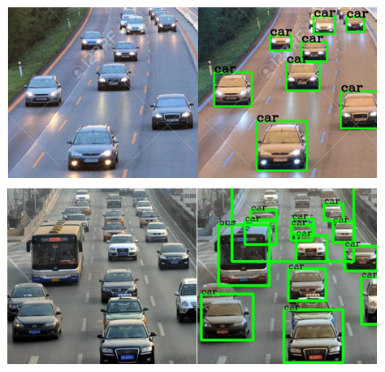

# Adaptive Traffic Signal Timer Project

## Overview
This project is an implementation of an Adaptive Traffic Signal Timer using real-time vehicle detection. The system dynamically adjusts traffic signal timings based on the number of vehicles detected in each lane, optimizing traffic flow and reducing congestion.

---

## Features
- **Real-Time Vehicle Detection**: Detects vehicles using YOLOv3 object detection model.
- **Dynamic Signal Timing**: Adjusts signal timings based on real-time traffic density.
- **Simulation Environment**: Provides a simulated environment for testing the adaptive traffic signal system.
- **Output Visualization**: Displays vehicle detection and traffic signal adjustments in a visual format.

---

## Prerequisites
Make sure you have the following installed:

- Python 3.8+
- pip
- TensorFlow

---

## Installation
1. **Clone the Repository:**

```bash
$ git clone https://github.com/anjana2123/Adaptive_Traffic_Signal_Timer_Project.git
$ cd Adaptive_Traffic_Signal_Timer_Project
```

2. **Install Dependencies:**

```bash
$ pip install -r requirements.txt
```

3. **Set Up YOLOv3:**
   - Download the YOLOv3 weights from the official [darknet website](https://pjreddie.com/darknet/yolo/).
   - Place the weights file in the `darkflow` directory.

---

## Usage
1. **Run Vehicle Detection:**

```bash
$ python vehicle_detection.py
```
This script detects vehicles in the test images and outputs the results in the `output_images` directory.

2. **Simulate Adaptive Traffic Signals:**

```bash
$ python simulation.py
```
This script simulates the traffic signal adjustment based on detected vehicle densities.

---

## Directory Structure
```plaintext
.
├── darkflow              # Contains YOLOv3 model configuration and weights
├── images                # Input images for vehicle detection
├── output_images         # Output images after vehicle detection
├── test_images           # Test images for simulation
├── requirements.txt      # List of dependencies
├── setup.py              # Setup script
├── simulation.py         # Script for simulating traffic signals
├── traffic-signal.jpg    # Visualization of traffic signal logic
├── vehicle-detection.png # Example of vehicle detection
├── vehicle_detection.py  # Script for detecting vehicles
```

---

## How It Works
1. **Vehicle Detection**:
   - YOLOv3 is used to detect vehicles in real-time from traffic images.
   - Vehicle counts for each lane are calculated.

2. **Adaptive Timer Logic**:
   - Signal duration is adjusted proportionally to the number of vehicles detected in each lane.
   - The system ensures fairness by avoiding long wait times for low-density lanes.

3. **Visualization**:
   - Outputs include processed images with detected vehicles and the corresponding signal timings.

---

## Sample Output
### Vehicle Detection:


### Traffic Signal Logic:


---

## Future Enhancements
- Integrate live video feeds for real-time detection.
- Enhance the model for multi-class detection (e.g., distinguishing between cars, bikes, and buses).
- Implement traffic prediction using machine learning.
- Deploy the system on an edge device for field use.

---

## License
This project is licensed under the MIT License. See the [LICENSE](LICENSE) file for details.

---

## Author
**Anjana Ramachandran**  
Feel free to reach out for queries or collaborations via [LinkedIn](https://www.linkedin.com/in/anjanaram03/).

---

## Acknowledgements
- The YOLOv3 model by Joseph Redmon and Ali Farhadi.
- Inspiration from various real-time traffic management systems.
